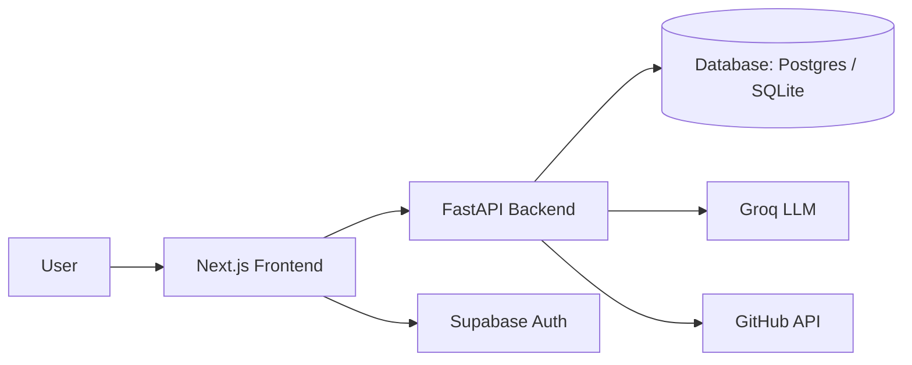

# InterviewAI Architecture

## Overview

InterviewAI is a full-stack AI mock interview platform that lets a user practice technical interviews in two ways:

- GitHub mode: questions are derived from the user’s public repositories
- Skill mode: questions are generated from a curated set of technical topics

The system combines a Next.js frontend, a FastAPI backend, Groq-hosted LLM services, and optional Supabase authentication and persistence.

## High-level architecture



## Core components

### 1. Frontend

Location: [frontend](frontend)

The frontend is built with Next.js 14 using the Pages Router and Tailwind CSS.

Responsibilities:
- Render the home page and interview setup flow
- Let users choose GitHub mode or skill mode
- Support text-based and voice-based interviews
- Display the live chat UI during the interview
- Show the final score, feedback, and transcript on the results page

Key files:
- [frontend/pages/index.tsx](frontend/pages/index.tsx) — landing page and interview start flow
- [frontend/pages/interview/[id].tsx](frontend/pages/interview/[id].tsx) — live interview experience
- [frontend/pages/results/[id].tsx](frontend/pages/results/[id].tsx) — results and transcript view
- [frontend/components/VoiceInterview.tsx](frontend/components/VoiceInterview.tsx) — browser-based voice recording and playback
- [frontend/lib/api.ts](frontend/lib/api.ts) — typed API client used by the UI

### 2. Backend API

Location: [backend](backend)

The backend is a FastAPI service that exposes REST endpoints for interview creation, message submission, voice processing, completion, and health checks.

Responsibilities:
- Validate input and enforce business rules
- Coordinate the interview lifecycle
- Persist interviews and messages
- Integrate with LLM and GitHub services
- Handle optional auth and access control

Key files:
- [backend/main.py](backend/main.py) — app initialization, CORS, rate limiting, and route registration
- [backend/routers/interviews.py](backend/routers/interviews.py) — interview lifecycle and conversation logic
- [backend/routers/github_router.py](backend/routers/github_router.py) — GitHub profile and repository fetching
- [backend/routers/ai.py](backend/routers/ai.py) — AI question generation, scoring, transcription, and TTS

### 3. Persistence layer

Location: [backend/models.py](backend/models.py), [backend/db.py](backend/db.py)

The app uses SQLAlchemy ORM models on top of either:
- PostgreSQL via Supabase in production, or
- SQLite locally for development

Core entities:
- User — optional authenticated identity
- Interview — a single interview session
- Message — each question/answer exchanged during the interview

The Interview model also stores JSON metadata such as:
- GitHub repository context
- selected skill topic
- interview style

### 4. AI layer

Location: [backend/routers/ai.py](backend/routers/ai.py)

The AI layer is isolated from the routing layer so the system can change LLM providers or models without altering the rest of the application.

It provides:
- next-question generation for GitHub-based interviews
- skill-question generation for topic-based interviews
- scoring of the final interview transcript
- audio transcription for voice answers
- text-to-speech synthesis for the voice interview experience

### 5. Authentication and authorization

Location: [backend/auth.py](backend/auth.py)

Authentication is optional and designed to degrade gracefully.

Behavior:
- If a Supabase JWT is present, the backend can identify the caller
- Interviews can be protected from unauthorized access
- Anonymous use still works when auth is not configured

This keeps the app usable while still allowing future account-based features.

## Interview flow

### 1. Start interview

The user opens the landing page and chooses:
- GitHub mode or skill mode
- text or voice mode

The frontend calls the create interview endpoint.

The backend then:
1. Validates the input
2. Resolves GitHub repos or skill context
3. Generates the first interview question using the LLM
4. Creates the Interview and initial assistant Message records
5. Optionally returns base64 audio for the first voice question

### 2. Answer questions

During the interview:
- In text mode, the user types an answer and it is sent to the backend
- In voice mode, the browser records audio, sends it to the backend, and the backend transcribes it

After each response, the backend:
- stores the user answer
- asks the next question
- preserves the conversation in the database

### 3. Complete interview

After the fifth question, the user finishes the interview.

The backend:
- collects the transcript history
- sends it to the scoring model
- stores the resulting score and feedback
- marks the interview as completed

The frontend then redirects the user to the results view.

## Request lifecycle example

```text
User -> Frontend -> POST /api/interviews
Frontend -> Backend -> Validate payload
Backend -> GitHub API or skill config
Backend -> Groq -> generate first question
Backend -> Database -> save interview + initial message
Backend -> Frontend -> return interview id and first question
```

## Design principles

- Separation of concerns: frontend, API, AI, and persistence are kept distinct
- Graceful degradation: the app works without full auth or external services configured
- Lightweight architecture: no heavy client-side dependencies are required
- Extensibility: the AI logic is isolated so models and providers can be swapped later

## Deployment model

The project is designed for low-cost deployment:
- Frontend: Vercel
- Backend: Railway
- Database: Supabase
- LLM access: Groq

## Summary

InterviewAI is a modular application where:
- the Next.js frontend provides the interview UX,
- FastAPI orchestrates the interview lifecycle,
- SQLAlchemy persists conversation state,
- Groq powers question generation, scoring, transcription, and speech synthesis,
- and Supabase provides optional authentication and database hosting.
